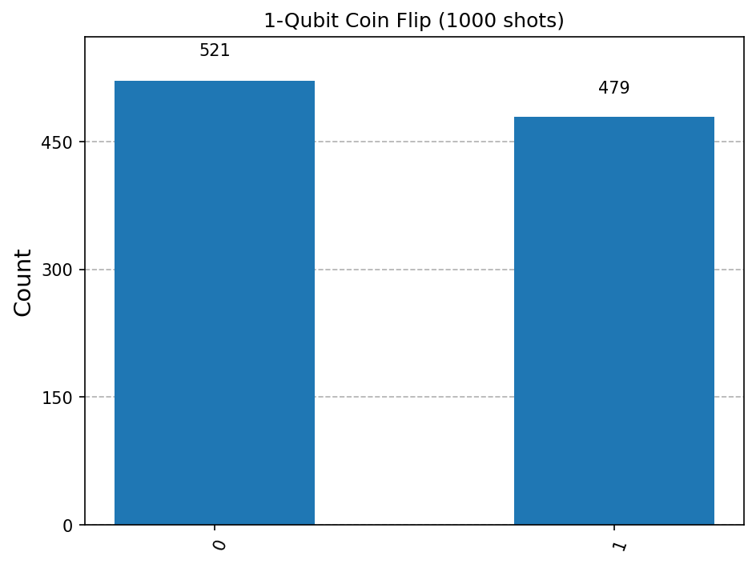
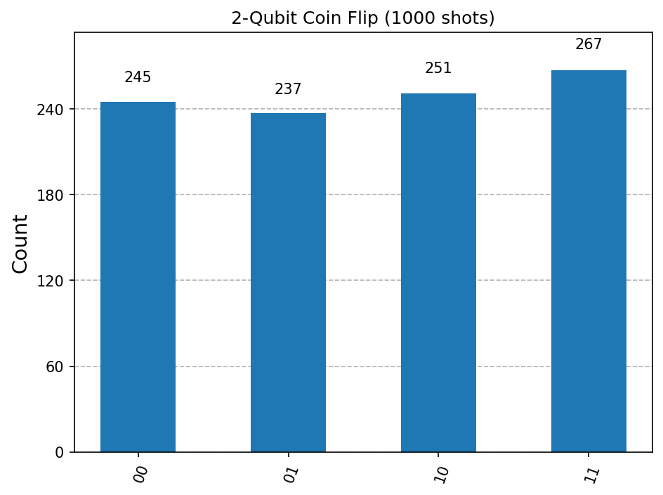
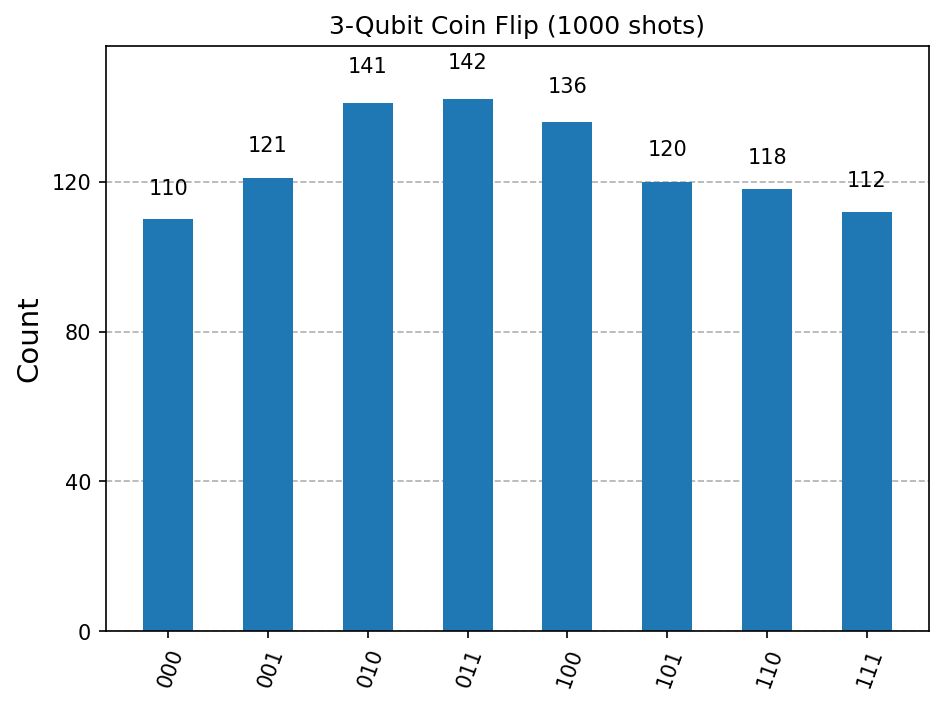

# quantum_coin_flip
Quantum coin flip simulation using Qiskit demonstrating superposition, measurement, and quantum probability distributions.

A quantum circuit built with Qiskit that demonstrates superposition using a 
Hadamard gate. Unlike a classical coin flip where the outcome is unknown but 
definite, a qubit in superposition has no definite value until the moment it 
is measured.

## The Quantum Concept

A qubit starts in state |0⟩. Applying the Hadamard gate produces:

|ψ⟩ = (|0⟩ + |1⟩) / √2

The amplitude of each basis state is 1/√2. Probability is the square of the 
amplitude — the Born rule — so each outcome has exactly (1/√2)² = 0.5 
probability. This is not an approximation, it is exact.

**This is not the same as classical randomness.**

A classical coin is heads or tails before you look — you just do not know 
which. A qubit in superposition has no definite value at all until it is 
measured. The randomness is fundamental, not a product of ignorance. 
Bell's theorem confirms this experimentally — there are no hidden variables 
that secretly determine the outcome in advance.


## Circuit

The circuit is simple: initialise a qubit in |0⟩, apply H, measure.
For multiple qubits, H is applied independently to each one. The qubits 
are not entangled — this is independent superposition.


## Results

Running 1000 shots on 1, 2, and 3 qubits:

**1 qubit** — 2 possible outcomes, ~50% each



**2 qubits** — 4 possible outcomes (00, 01, 10, 11), ~25% each



**3 qubits** — 8 possible outcomes (000 through 111), ~12.5% each



Each additional qubit doubles the outcome space. With n qubits there are 
2ⁿ possible states, each with equal probability 1/2ⁿ. The distribution 
converges toward uniform as shot count increases.

## What the Results Mean

The near-uniform distribution is a direct consequence of the Hadamard gate 
setting equal amplitudes on all basis states. The small deviations from 
exactly 50/50 are statistical fluctuations — they decrease as 1/√N where 
N is the number of shots. Run 10,000 shots and the distribution gets closer. 
Run 1,000,000 and it is essentially flat.

The key point: this cannot be explained by a hidden classical variable 
secretly determining each outcome in advance. Quantum mechanics is 
irreducibly probabilistic.

```

Histograms are saved to the project folder
